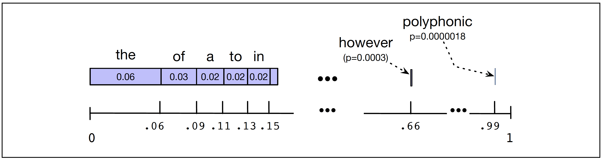

<section class="title">
  
Lecture 02 - 𝑵-gram Language Models

  
NLP and LLMs (CS40008.01)

  

    
Baojian Zhou

    
School of Data Science

    
Fudan University

    
03/05/2026

  

</section>

---

<section class="ppt">
  
Outline

  

  <ul class="outline-bullets big">
  <li class="active">Probabilistic N-gram LMs</li>
  <li class="muted">Evaluating LMs and Perplexity</li>
  <li class="muted">Smoothing N-gram LMs</li>
  <li class="muted">Neural Proabablistic LMs</li>
  </ul>
</section>

---

<section class="ppt">
  
Assign probabilities to sentences

  

  <ul style="font-size: 50px; line-height: 1.1; font-weight: 600; margin-top: 1px;">
      <ul style="font-size: 42px; margin-top: 20px;">
        <li class="fragment">Speech Recognition
          <ul style="font-size: 32px; margin-top: 20px; margin-bottom: 20px; font-weight: 500;">
            <li>$P($It's hard to recognize speech$) > P($It's hard to wreck a nice beach$)$</li>
          </ul>
        </li>
        <li class="fragment">Machine Translation (MT)
          <ul class="spaced-list" style="font-size: 32px; margin-top: 20px; margin-bottom: 20px; font-weight: 500;">
            <li>"他向记者介绍了主要内容" is translated into 4 candidates:</li>
            <li>$S_1$ = He briefed reporters on the main contents of the statement</li>
            <li>$S_2$ = He introduced reporters to the main contents of the statement</li>
            <li>$S_3$ = He briefed to reporters the main contents of the statement</li>
            <li>$S_4$ = He to reporters introduced main content</li>
            <li>A good MT model should have $P($$S_1$ $)> P(S_2) \approx P(S_3) >P($ $S_4$$)$</li>
          </ul>
        </li>
        <li class="fragment">Spell Correction
          <ul style="font-size: 32px; margin-top: 20px; margin-bottom: 20px; font-weight: 500;">
            <li>The office is about fifteen minuets from my house</li>
            <li>$P($about fifteen minutes from$) > P($about fifteen minuets from$)$</li>
          </ul>
        </li>
      </ul>
  </ul>
</section>

---

<!-- Slide 1: The setting -->
<section class="ppt">
  
LLMs approximate an unknown distribution

  

  

    

      Real text-based data (languages, code, etc) induces a distribution over token sequences:
      $$\mathbf{w}_{1:n} = (w_1,\dots,w_n), \quad \mathbf{w}_{1:n} \sim p_{\text{data}}(\cdot),$$
      where $p_{\text{data}}$ is unknown. We only observe a corpus (samples):
      $$\mathcal{D}=\{\mathbf{w}^{(i)}\}_{i=1}^N,\quad \mathbf{w}^{(i)}\overset{\text{i.i.d.}}{\sim} p_{\text{data}}(\cdot).$$
    

    

      We build and train a model distribution (LLMs) $p_\theta(\mathbf{w})$ such that
      $$p_\theta(\mathbf{w}) \approx p_{\text{data}}(\mathbf{w}).$$
    

    

      In $p_\theta$,
      sequences that look like real language should get
      higher probability than corrupted/random ones:
      $p_\theta(\text{“natural sentence”})\;>\;p_\theta(\text{“random sentence”}).$
    

  

</section>

---

<section class="ppt">
  
Training objective: make \(p_\theta \approx p_{\text{data}}\)

  

  

    

      Ideal goal (distribution matching) is to make $p_\theta \approx p_{\text{data}}.$ To do this, one principled way is to find a $\theta$ such that the KL divergence is minimized, i.e.,
      $$\theta^\star=\arg\min_\theta \mathrm{KL}\big(p_{\text{data}} \,\|\, p_\theta\big).$$
    

    

      This is equivalent to maximizing expected log-likelihood:
      $$\arg\min_\theta \mathrm{KL}(p_{\text{data}}\|p_\theta)
      \;\Longleftrightarrow\;
      \arg\max_\theta \mathbb{E}_{\mathbf{w} \sim p_{\text{data}}}\big[\log p_\theta(\mathbf{w})\big].$$
    

    

      Since \(p_{\text{data}}\) is unknown, use the dataset $\{\mathbf{w}^{(i)}\}_{i=1}^N$ to approximate the expectation:
      $$\max_\theta \frac{1}{N}\sum_{i=1}^N \log p_\theta (\mathbf{w}^{(i)}).$$
    

  

</section>

---

<section class="ppt">
  
Training objective: make \(p_\theta \approx p_{\text{data}}\)

  

  

    

      Since \(p_{\text{data}}\) is unknown, use the dataset $\{\mathbf{w}^{(i)}\}_{i=1}^N$ to approximate the expectation:
      $$\max_\theta \frac{1}{N}\sum_{i=1}^N \log p_\theta (\mathbf{w}^{(i)}).$$
    

    

      Let $\mathbf{w}^{(i)} := (w_1^{(i)},\ldots,{w}_{n_i}^{(i)})$. The LM factorization (what the model actually learns):
      $$p_\theta(\mathbf{w}^{(i)})=\prod_{t=1}^{n_i} p_\theta \left(w_t^{(i)} \mid w_{1:t-1}^{(i)} \right).$$
      

        So training teaches the model to predict the next token like real text →
        sampling from \(p_\theta\) produces human-like sequences.
      

    

  

</section>

---

<section class="ppt">
  
Training samples from real-world

  

  

    <!-- Left: dataset notation -->
    

      $$\mathcal{D}=\left\{\mathbf{w}^{(i)}\right\}_{i=1}^{N}=$$
    

    

  

    

      
\(\mathbf{w}^{(1)}\) : It′s hard to recognize speech.

      
\(\mathbf{w}^{(2)}\) : He briefed reporters on the main contents of the statement.

      
\(\mathbf{w}^{(3)}\) : The office is about fifteen minutes from my house.

      
\(\mathbf{w}^{(4)}\) : I want to learn how to play the guitar.

      
\(\vdots\)

      
$\mathbf{w}^{(i)}$ : #include<stdio.h> int main(void){ printf (“Hello, world!\n”);}

      
\(\vdots\)

    

  

  

  

    Assume $\mathbf{w}^{(i)} \overset{\text{i.i.d.}}{\sim} p_{\text{data}}$ and train $p_\theta$ to fit these samples.
  

</section>

---

<!-- (Optional) small CSS helpers (put once near the top of your reveal HTML) -->

<!-- Slide 1 -->
<section class="ppt">
  
Compute \(P(w_{1:t})\)

  

  

    <!-- Left column -->
    

      <ul class="bigul">
        <li>
          Write sentence \(\mathbf{w}=[w_1,w_2,\ldots, w_n]\) as \(w_{1:n}\),
          

            \[
              P(\mathbf{w}) \equiv P(w_{1:n})
            \]
          

        </li>
        <li>
          Let $X_1 = w_1, X_2 = w_2$, recall the Chain rule
          \[ P(X_1X_2)=P(X_1)\cdot P(X_2\mid X_1) \]
        </li>
        <li>
          Applying the Chain rule to sentence \(w_{1:n}\)
          

            \[
              P(w_{1:n})=\prod_{t=1}^{n} P\!\left(w_t \mid w_{1:t-1}\right)
            \]
          

          <ul class="subul">
            <li> \(w_{1:t-1}\) is called history of \(w_t\)</li>
            <li>We assume \(w_{1:0}=w_0=\text{BOS}\).</li>
            <li>We assume last token \(w_n=\text{EOS}\).</li>
            <li>
              When applying the Chain rule, to compute \(P(w_{1:n})\) is essentially a
              next word prediction problem
            </li>
          </ul>
        </li>
      </ul>
    

    

      

      

        Key success of almost all modern LLMs: Better next-token prediction ⇒ better language modeling. 
      

      

      

        <!-- Replace this with your video tag / embed -->
        

        <video controls style="width:100%; height:260px; border-radius:14px;"><source src="media/predicting-next-word.mp4" type="video/mp4"></video>
        

      

    

  

</section>

---

<section class="ppt">
  
The \(N\)-gram model

  

  <ul class="bigul">
    <li>
      <b>Intuition:</b> instead of using entire history \(w_{1:t-1}\), we can
      approximate probability by using the last few \((N)\) words
    </li>
    <li>

      <b>Unigram model</b> \((N=1)\)
      <ul class="subul">
        <li>Approximates \(P(\cdot)\) without history: $\quad P(w_t \mid w_{1:t-1}) \approx q(w_t)$</li>
        <li> Example: $P(\text{skills}\mid \text{I want to improve my cooking}) \approx P(\text{skills})$ </li>
      </ul>
    </li>
    <li>

      <b>Bigram model</b> \((N=2)\)
      <ul class="subul">
        <li>Approximates \(P(\cdot)\) by only using \(w_{t-1}\): $\quad P(w_t \mid w_{1:t-1}) \approx q(w_i \mid w_{t-1})$</li>
        <li>Example: $P(\text{skills}\mid \text{I want to improve my cooking}) \approx q(\text{skills}\mid \text{cooking})$</li>
      </ul>
    </li>
    <li>

      <b>Trigram model</b> \((N=3)\)
      <ul class="subul">
        <li>Approximates \(P(w_t\mid w_{1:t-1})\) by only using \(w_{t-2:t-1}\): $\quad P(w_i\mid w_{1:t-1}) \approx q(w_i \mid w_{t-2:t-1})$</li>
        <li>Example: $P(\text{skills}\mid \text{I want to improve my cooking}) \approx q(\text{skills}\mid \text{my cooking})$</li>
      </ul>
    </li>
  </ul>

  

    <ul style="font-size: 30px; line-height: 1.25;">
      <li>
        <b>The above approximations use the <b>Markov assumption</b>. In general, for \(N\)-gram</b> \((N\ge 2)\):
      </li>
      \[
          \text{(N-1)-order Markov:}\qquad P(w_t \mid w_{1:t-1}) \approx q(w_t \mid w_{t-N+1:t-1}).
        \]
    </ul>
  

</section>

---

<section class="ppt">
  
Build N-gram LMs

  

  

    <!-- Left: key definitions -->
    

      <ul class="bigul" style="font-size: 32px;">
        <li><b>Step 1</b>: Pick up an order $N$</li>
        <li><b>Step 2</b>: Curate your training data \(\mathcal{D}\) and vocabulary $\mathcal{V}$
          <ul style="font-size: 0.85em; margin-top: 10px;">
          

          <li>Step 2.1: Collect raw data (tokenization, filtering)</li>
          

          <li>Step 2.2: Build vocabulary $\mathcal{V}$ after tokenization </li>
          </ul>
        </li>
        <li><b>Step 3</b>: Estimate your paramters $$P(w_t\mid w_{t-N+1:t-1})$$ (<b>Q: How many parameters will we have ?</b>)</li>
        <li><b>Step 4</b>: Test your model by generating sentences or estimating log probabilities (or perplexity) of given sentence in test dataset</li>
      </ul>
    

    

      
Whiteboard:  Estimate bigram $P(w_t|w_{t-1})$
      

      

      

      Let $\mathcal{V}=\{v_1,v_2,\ldots,v_{|V|}\}$.
      Define all possible paramters \[
        \theta_{i,j} = P(w_t=v_i|w_{t-1}=v_j)
        \]
      \[\boldsymbol{\theta}
      = \begin{bmatrix}
      \theta_{11} & \theta_{12} & \theta_{13} & \cdots & \theta_{1 |\mathcal{V}|}\\
      \theta_{21} & \theta_{22} & \theta_{23} & \cdots & \theta_{2 |\mathcal{V}|}\\
      \theta_{31} & \theta_{32} & \theta_{33} & \cdots & \theta_{3 |\mathcal{V}|}\\
      \vdots      & \vdots      & \vdots      & \ddots & \vdots     \\
      \theta_{|\mathcal{V}| 1} & \theta_{|\mathcal{V}| 2} & \theta_{|\mathcal{V}| 3} & \cdots & \theta_{|\mathcal{V}| |\mathcal{V}|}
      \end{bmatrix}
      \]
      

      

      

        

        <li><b>MLE for bigram model:</b>
        $$p_\theta(v_i|v_j) = \frac{C(v_i v_j)}{C(v_i)},$$ where $C(v_i v_j)$ counts total frequency of bigram $[v_i,v_j]$ in training corpus. </li>
        

        <li><b>Potential parameters ($N=2$)</b>: $\mathcal{O}(|\mathcal{V}|^2)$</li>
        

        <li><b>$N$-gram is not scalable: $\mathcal{O}(|\mathcal{V}|^N)$</b></li>
      

    

  

</section>

---

<section class="ppt">
  
Toy example of training bigram LM

  

  

    <ul style="margin-top: 6px;">
      <li class="fragment" data-fragment-index="1">
        <b>Maximum likelihood estimate</b> (bigram model):
        \[
          p_\theta(w_i \mid w_{i-1})
          = \frac{C(w_{i-1}w_i)}{\sum_{w\in \mathcal{V}} C(w_{i-1}w)}
          = \frac{C(w_{i-1}w_i)}{C(w_{i-1})}.
        \]
        <ul style="font-size: 24px; margin-top: 8px; line-height: 1.25;">
          <li>\(C(x)\): frequency of \(x\) in the corpus</li>
          <li>\(\mathcal{V}\): vocabulary of running text</li>
        </ul>
      </li>
      <li class="fragment" data-fragment-index="2" style="margin-top: 10px;">
        <b>An example of training corpus ($\mathcal{V}=\{EOS, I, am, Sam, do, not, like, eggs, and, ham\}$)</b> as follows
        

          
BOS I am Sam EOS

          
BOS Sam I am EOS

          
BOS I do not like eggs and ham EOS

        

      </li>
      <li class="fragment" data-fragment-index="3" style="margin-top: 10px;">
        <b>Then we have part of parameter estimations</b>
        

          

            \[
              p_\theta(I\mid \text{BOS})=\frac{2}{3}=0.67
            \]
            \[
              p_\theta(\text{EOS}\mid Sam)=\frac{1}{2}=0.50
            \]
          

          

            \[
              p_\theta(Sam\mid \text{BOS})=\frac{1}{3}=0.33
            \]
            \[
              p_\theta(Sam\mid am)=\frac{1}{2}=0.50
            \]
          

          

            \[
              p_\theta(am\mid I)=\frac{2}{3}=0.67
            \]
            \[
              p_\theta(do\mid I)=\frac{1}{3}=0.33
            \]
          

        

      </li>
    </ul>

  

</section>

---

<section class="ppt">
  
Bigram statistics from restaurant reviews

  

  

    

      <ul class="bigul" style="font-size: 32px;">
        <li>
          \(\mathcal{D}\): restaurant reviews (e.g., 1000 sentences)
        </li>
        <li style="margin-top: 10px;">
          Example sentences from reviews
          <ul class="subul" style="font-size: 26px;">
            <li>Wow... Loved this place ...</li>
            <li>Not tasty and the texture was just nasty ...</li>
            <li>The selection on the menu was great and ...</li>
          </ul>
        </li>
        <li style="margin-top: 10px;">
          Add boundary tokens: BOS ... EOS
        </li>
      </ul>
    

    

        
Bigram counts: $C(w_{i-1},w_i)$ 

        
Bigram MLE: $p_\theta(w_i\mid w_{i-1})=\frac{C(w_{i-1},w_i)}{C(w_{i-1})}$

        

          We can visualize a small sub-matrix for selected words
          (e.g., i, want, to, eat, in, this, place).

      

    

    

    

    

        <pre style="
          background: rgba(0,0,0,0.04);
          margin: 0;
          font-size: 20px;
          line-height: 1.25;
          white-space: pre;
        ">
      Bigram counts (subset)  
      split: train rows: 3000
      columns: ['text']
      Vocab size: 5166
      Distinct bigrams: 22179  
              i   want   to  eat  in  this  place
      i       0     5     0   1   0    0     0
      want    0     0    11   0   0    0     0
      to      0     1     0  12   2    6     2
      eat     0     0     0   0   2    0     0
      in      0     0     3   0   0   24     2
      this    1     0     4   0   2    0    73
      place   2     0    10   0   3    0     0
        </pre>
      

    

  

</section>

---

<!-- One concise reveal slide summarizing the 3 images -->
<section class="ppt">
  
Practical issues in \(N\)-gram LMs

  

  

    <!-- Left: sentence boundaries -->
    

      

        

          1) Sentence boundaries
        

        

          Need extra context at the start/end.
        

        

          For trigram:
          \[
            q(w_1\mid \text{BOS},\text{BOS})
          \]
        

        

          Add tokens: BOS … EOS
        

      

      The word like, Thisisahardtofindword simply did not occur in our training set but could be in our test test
    

    <!-- Right: unknown words (OOV) -->
    

      

        

          2) Unknown words (OOV)
        

        <ul style="margin: 0; padding-left: 26px; font-size: 28px; line-height: 1.25;">
          <li class="fragment">
            <b>Closed vocabulary:</b> test words must be in a fixed lexicon
          </li>
          <li class="fragment" style="margin-top: 8px;">
            <b>Open vocabulary:</b> map unseen words to a pseudo-token
            &lt;UNK&gt;
          </li>
          <li class="fragment" style="margin-top: 10px;">
            <b>How to train</b> \(P(\text{UNK}\mid \cdot)\)?
            <ul style="margin-top: 6px; font-size: 26px; line-height: 1.22;">
              <li class="fragment">
                <b>Prior vocab:</b> convert OOV in training to &lt;UNK&gt;, then count it
              </li>
              <li class="fragment">
                <b>No prior vocab:</b> replace rare words (freq &lt; \(n\)) with &lt;UNK&gt;
                (or keep top \(|V|\) words)
              </li>
            </ul>
          </li>
        </ul>
      

    

  

</section>

---

<section class="ppt">
  
Outline

  

  <ul class="outline-bullets big">
  <li class="muted">Probabilistic N-gram LMs</li>
  <li class="active">Evaluating LMs and Perplexity</li>
  <li class="muted">Smoothing N-gram LMs</li>
  <li class="muted">Neural Proabablistic LMs</li>
  </ul>
</section>

---

<section class="ppt">
  
Building LMs and evaluation

  

  

    <!-- LEFT COLUMN: upper = split bar, lower = extrinsic -->
    

      <!-- Upper-left: Train/Val/Test bar -->
      
Split your data into:

      

        

          Training Data
        

        

          Validation Data
        

        

          Testing Data
        

      

      <!-- Lower-left: Extrinsic evaluation -->
      

        

          Extrinsic evaluation
        

        <ul style="font-size: 26px; line-height: 1.25; margin: 0; padding-left: 26px;">
          <li>Compare models via <b>downstream tasks</b></li>
          <li style="margin-top: 8px;">
            Examples:
            <ul style="margin-top: 6px; font-size: 24px; line-height: 1.22;">
              <li>Spell correction accuracy</li>
              <li>Machine translation accuracy</li>
            </ul>
          </li>
          <li style="margin-top: 8px;">
            <b>Time-consuming</b> (can take days/weeks)
          </li>
        </ul>
      

    

    <!-- RIGHT COLUMN: Intrinsic evaluation -->
    

      

        Intrinsic evaluation
      

      <ul style="font-size: 26px; line-height: 1.25; margin: 0; padding-left: 26px;">
        <li>Does the LM prefer <b>good</b> sentences to <b>bad</b> ones?</li>
        <li style="margin-top: 8px;">Train on <b>training</b>, evaluate on unseen <b>test</b></li>
        <li style="margin-top: 8px;">Never leak test sentences into training</li>
        <li style="margin-top: 8px;">
          Probability-based metric:  
          <b>higher log-likelihood on test ⇒ better LM</b>
        </li>
      </ul>
      

      A reasonable metric:  
        \[
          \frac{1}{|\mathcal{D}_{\text{test}}|}
          \sum_{\mathbf{w}\in\mathcal{D}_{\text{test}}}
          \log p_\theta(\mathbf{w})
        \]
      

    
Whiteboard:  Estimate bigram $P(w_t|w_{t-1})$
      

    

  

</section>

---

<section class="ppt">
  
Perplexity

  

  

    <!-- LEFT: Definition -->
    

      

        Definition (intrinsic metric)
      

      <ul style="font-size: 26px; line-height: 1.25; margin: 0; padding-left: 26px;">
        <li>
          A better LM assigns <b>higher probability</b> to an unseen test set
          \(\;s_{1:m}\).
        </li>
        <li style="margin-top: 10px;">
          <b>Perplexity</b> is the inverse probability of the test set,
          normalized by length \(\,T=\sum_i |s_i|\):
        </li>
      </ul>
      

        \[
          \mathrm{PPL}(s_{1:m})
          = P(s_{1:m})^{-1/T}
          = \exp\!\left(-\frac{1}{T}\log P(s_{1:m})\right)
        \]
      

      

        Minimizing PPL \(\Longleftrightarrow\) maximizing test probability.
      

    

    <!-- RIGHT: Interpretation as branching factor -->
    

      

        Interpretation
      

      <ul style="font-size: 26px; line-height: 1.25; margin: 0; padding-left: 26px;">
        <li>
          Perplexity \(\approx\) <b>effective branching factor</b>:
          how many plausible next tokens the model considers.
        </li>
        <li style="margin-top: 10px;">
          Example: random digits \(\{0,\dots,9\}\), uniform guess
          \(P=1/10\) for each digit.
        </li>
      </ul>
      

        \[
          \mathrm{PPL}(s)=P(w_{1:t})^{-1/t}
          =\left(\left(\tfrac{1}{10}\right)^t\right)^{-1/t}
          =10
        \]
        

        <ul style="font-size: 26px; line-height: 1.25; margin: 0; padding-left: 26px;">
         <li style="margin-top: 10px;">If the model is totally random, it needs \(|V|\) guesses on average to get the next word right.</li>
         <li style="margin-top: 10px;">If $|\mathcal{V}|=1$, it surely picks right one. Hence, $\mathrm{PPL}(s_{1:m})=1$</li>

      </ul>

  

</section>

---

<section class="ppt">
  
Lower perplexity – better model

  

  

    <ul style="margin-top: 0;">
      <li class="fragment" data-fragment-index="1">
        Training 38 million words, test 1.5 million words (WSJ)
      </li>
    </ul>
    <!-- Table -->
    

      <table style="
        border-collapse: collapse;
        font-size: 28px;
        min-width: 820px;
        box-shadow: 0 2px 10px rgba(0,0,0,0.06);
        border-radius: 10px;
        overflow: hidden;
      ">
        <thead>
          <tr style="background: #3d67c7; color: white;">
            <th style="padding: 10px 16px; text-align:center; font-weight: 900;">N-gram Order</th>
            <th style="padding: 10px 16px; text-align:center; font-weight: 900;">Unigram</th>
            <th style="padding: 10px 16px; text-align:center; font-weight: 900;">Bigram</th>
            <th style="padding: 10px 16px; text-align:center; font-weight: 900;">Trigram</th>
          </tr>
        </thead>
        <tbody>
          <tr style="background: rgba(61,103,199,0.14);">
            <td style="padding: 10px 16px; text-align:center; font-weight: 800;">Perplexity</td>
            <td style="padding: 10px 16px; text-align:center; font-weight: 800;">962</td>
            <td style="padding: 10px 16px; text-align:center; font-weight: 800;">170</td>
            <td style="padding: 10px 16px; text-align:center; font-weight: 800;">109</td>
          </tr>
        </tbody>
      </table>
    

    <ul style="margin-top: 0;">
      <li class="fragment" data-fragment-index="3">
        The improvement in perplexity does <b>not</b> guarantee an (extrinsic) improvement in
        downstream tasks like speech recognition or MT.
      </li>
      <li class="fragment" data-fragment-index="4" style="margin-top: 10px;">
        Because perplexity often correlates with such improvements, it is commonly used as a
        <b>quick check</b> on an algorithm.
      </li>
      <li class="fragment" data-fragment-index="5" style="margin-top: 10px;">
          <a href="https://arxiv.org/pdf/2005.14165.pdf"
            target="_blank"
            rel="noopener noreferrer"
            style="color:#1f6feb; font-weight:800; text-decoration: underline;">
            https://arxiv.org/pdf/2005.14165.pdf
          </a>
          (See how GPT-3 uses PPL)
      </li>
    </ul>
  

</section>

---

<section class="ppt">
  
Sentence sampling

  

  

    <!-- LEFT: bullets + image at bottom-left -->
    

      <!-- bullets -->
      

        <ul class="bigul" style="font-size: 32px; line-height: 1.22;">
          <li style="margin-bottom: 10px;">
            <b>Unigram case</b>
            <ul class="subul" style="font-size: 26px; line-height: 1.25; margin-top: 10px;">
              <li>
                Partition \([0,1]\) into intervals, each word gets an interval proportional to its frequency.
              </li>
              <li>
                Sample \(u\sim \mathrm{Unif}[0,1]\), output the word whose interval contains \(u\).
              </li>
              <li>
                Repeat until we generate EOS.
              </li>
            </ul>
          </li>
        </ul>
      

      <!-- bottom-left image -->
      

        
        <li class="fragment"  data-fragment-index="1" style="margin-top: 14px; font-size: 30px;">
            <b>What about bigram case?</b>
          </li>
      

    

    <!-- RIGHT: sample outputs -->
    

      

        Samples from built LM (trained by the Wall Street Journal (40M))
      

      

        <b>1-gram:</b>
        Months the my and issue of year foreign new exchange’s September
        were recession exchange new endorsed a acquire to six
        <b>executives</b>
      

      

        <b>2-gram:</b>
        Last December through the way to preserve the
        <b>Hudson corporation</b>
        ... would seem to complete the major central planners ...
        <b>M. X. corporation</b>
        ...
      

      

        <b>3-gram:</b>
        They also point to ninety nine point
        <b>six billion dollars</b>
        ... 
        <b>six three percent</b>
        ...
        <b>on market conditions</b>
      

    

  

</section>

---

<section class="ppt">
  
Outline

  

  <ul class="outline-bullets big">
  <li class="muted">Probabilistic N-gram LMs</li>
  <li class="muted">Evaluating LMs and Perplexity</li>
  <li class="active">Smoothing N-gram LMs</li>
  <li class="muted">Neural Proabablistic LMs</li>
  </ul>
</section>

---

<section class="ppt">
  
Smoothing: intuition

  

  

    <!-- LEFT: bullets -->
    

      <ul style="margin-top: 0; padding-left: 28px;">
        <li class="fragment" data-fragment-index="1">
          When we have <b>sparse statistics</b>
        </li>
      </ul>
      

        \(q(w \mid \text{denied the})\)
      

      <ul style="margin-top: 10px; padding-left: 28px;">
        <li class="fragment" data-fragment-index="4" style="margin-top: 10px;">
          <b>Steal probability mass</b> to generalize better
        </li>
        <li class="fragment" data-fragment-index="6" style="margin-top: 10px;">
          <b>How to steal?</b>
        </li>
      </ul>
    

    <!-- RIGHT: charts recreated in pure HTML -->
    

      <!-- TOP: raw sparse counts -->
      

        

          Raw counts (many zeros)
        

        <!-- bars container -->
        

          <!-- bar template: height in px, label rotated -->
          

            
3

            

              

                allegations
              

            

          

          

            
2

            

              

                reports
              

            

          

          

            
1

            

              

                claims
              

            

          

          

            
1

            

              

                request
              

            

          

          <!-- zeros -->
          

            
0

            

            

              attack
            

          

          

            
0

            

            

              man
            

          

          

            
0

            

            

              outcome
            

          

          
…

        

      

      <!-- BOTTOM: after smoothing (redistribute mass) -->
      

        

          <!-- small table -->
          

            
\(P(w \mid \text{denied the})\)

            
2.5 &nbsp; allegations

            
1.5 &nbsp; reports

            
0.5 &nbsp; claims

            
0.5 &nbsp; request

            

              2
              &nbsp; other
            

          

          <!-- smoothed bars -->
          

            

              After smoothing (some mass for “other”)
            

            

              

              

              

              

              <!-- "other" mass shown in green -->
              

              
…

            

            

              
all.

              
rep.

              
cl.

              
req.

              
other

            

          

        

      

    

  

</section>

---

<section class="ppt">
  
Quick summary: N-gram language models

  

  

    <ul style="margin-top: 0; padding-left: 30px;">
      <li class="fragment">
        <b>Idea:</b> approximate next-word probability using only the last \(N-1\) words
        \[
          P(w_t \mid w_{1:t-1}) \approx q(w_t \mid w_{t-N+1:t-1})
        \]
      </li>
      <li class="fragment" style="margin-top: 12px;">
        <b>Training:</b> estimate counts from a corpus (plus smoothing for unseen \(n\)-grams)
      </li>
      <li class="fragment" style="margin-top: 12px;">
        <b>Two major issues</b>
        <ul style="margin-top: 8px; font-size: 30px; line-height: 1.22;">
          <li>
            <b>Parameter explosion:</b> number of \(n\)-grams grows as \(|V|^N\)
            (e.g., \(|V|=10^4\Rightarrow\) trigram \(\sim 10^{12}\))
          </li>
          <li style="margin-top: 6px;">
            <b>Sparsity / poor generalization:</b> many test \(n\)-grams never appear in training
          </li>
        </ul>
      </li>
      <li class="fragment" style="margin-top: 12px;">
        <b>Today:</b> neural LMs (RNN/Transformer) address these issues via learned representations.
      </li>
    </ul>
  

</section>

---

<section class="ppt">
  
Language model toolkits and readings

  

  

    <ul style="margin-top: 0; padding-left: 28px;">
      <li style="margin-bottom: 12px;">
        <b>KenLM</b> (fast \(n\)-gram LM toolkit)
        

          <a href="https://kheafield.com/code/kenlm/" target="_blank" rel="noopener noreferrer"
             style="color:#1f6feb; font-weight:800; text-decoration: underline;">
            https://kheafield.com/code/kenlm/
          </a>
        

      </li>
      <li style="margin-bottom: 12px;">
        <b>Google N-Gram Release (Aug 2006)</b>
        

          <a href="https://ai.googleblog.com/2006/08/all-our-n-gram-are-belong-to-you.html"
             target="_blank" rel="noopener noreferrer"
             style="color:#1f6feb; font-weight:800; text-decoration: underline;">
            https://ai.googleblog.com/2006/08/all-our-n-gram-are-belong-to-you.html
          </a>
        

        

          Tokens: 1,024,908,267,229 · Sentences: 95,119,665,584 
          Unigrams: 13,588,391 · Fivegrams: 1,176,470,663
        

      </li>
      <li style="margin-bottom: 12px;">
        <b>SRILM</b> (classic LM toolkit)
        

          <a href="http://www.speech.sri.com/projects/srilm/" target="_blank" rel="noopener noreferrer"
             style="color:#1f6feb; font-weight:800; text-decoration: underline;">
            http://www.speech.sri.com/projects/srilm/
          </a>
        

      </li>
      <li style="margin-bottom: 12px;">
        <b>Alias method</b> (fast discrete sampling)
        

          <a href="https://www.keithschwarz.com/darts-dice-coins/" target="_blank" rel="noopener noreferrer"
             style="color:#1f6feb; font-weight:800; text-decoration: underline;">
            https://www.keithschwarz.com/darts-dice-coins/
          </a>
        

      </li>
      <li style="margin-top: 18px;">
        <b>Reading</b>:
        
          Chapter 4–5. <i>Naive Bayes and Sentiment Classification</i>. <i>Logistic Regression</i>
        
      </li>
    </ul>
  

</section>
